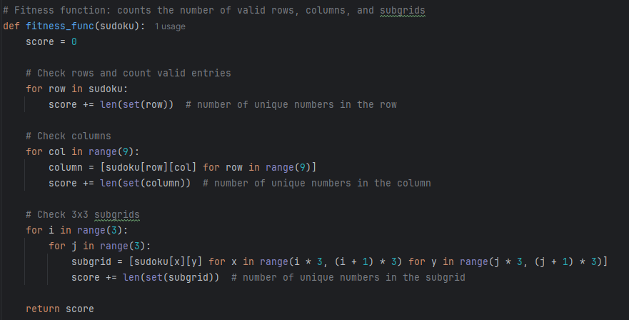
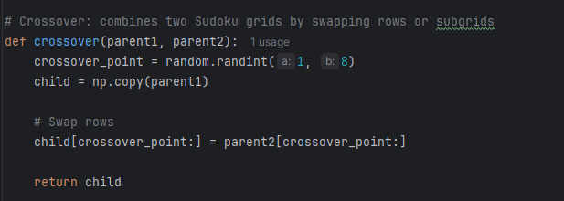
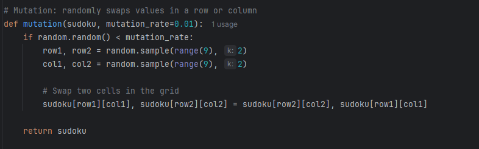
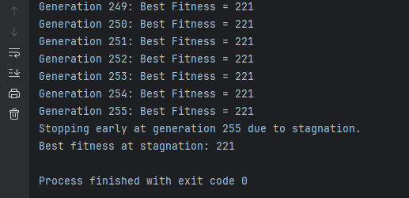
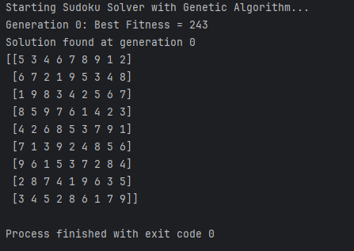
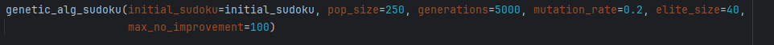

Sudoku Solver using Genetic Algorithms

A Genetic Algorithm (GA) for solving Sudoku puzzles involves evolving partial solutions to satisfy the constraints of a Sudoku board. The challenge here is to evolve a solution such that every row, column and 3x3 subgrid contains unique numbers (1 to 9).

Approach:

1. Representation: Each individual in the population represents a possible sudoku grid (9x9 matrix of numbers (positives int))
2. Fitness function: The fitness function measures how many constraints (rows, columns, subgrids) are satisfied. The feweer constrained violated, the higher the fitness
3. Selection: Parents are selected based on fitness, with fitter individuals, having a higher chance of being chosen
4. Crossover: Combines parts of two individuals (sudoku grids) to produce new candidates
5. Mutation: Randomly alters parts of an individual (swaps value in a row, column or subgrid) to introduce diversity
6. Termination: The algorithm stops when a solution that satisfies all constraints is found (or after a set number of generations)

The implementation of fitness function is represented below. The overall score is calculated as a total of row_score + column_score + subgrids_score.

The crossover type is single-point crossover. A random point is generated at each generation and combines two sudoku grids by swapping rows or subgrids.

In the mutation phase there are two randomly cells swapped in rows or columns.

For generation the initial population, a 9x9 matrix is generated with values from 1-9.

The selection method of the individuals is the tournament selection and there is also an elitism function to preserve the best individuals in the population.

And the solving function is represented below. There is a stopping condition if the target fitness score is achieved (243) or the max number of generation is achieved, the algorithm stops. Also there is an early stopping condition, if there are 100 consecutives generation with the same fitness score, then the algorithm will stop due to stagnation.
If the exit criteria is not met, then the algorithm pursues with the other steps that are presented above, such as selecting the best fitness score individuals for crossover. After that a mutation is introduced for diversity and a new population is created for the next generation.

Then in the main function an initial sudoku grid is given(9x9 matrix) and the solver function is called.
All the information is provided in the console and it should look like this:

As you can see, in this case the best fitness function is 221, but the algorithm stops due to stagnation (Test case 4 in the script).

In this case, a mostly completed sudoku was given, and in the first generation the target fitness score (243) is achieved (Test case 5 in the script).

In conclusion the algorithm works as expected, for fine-tuning there could be some modifications added to the parameters, as in the picture below:

